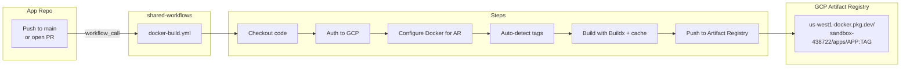
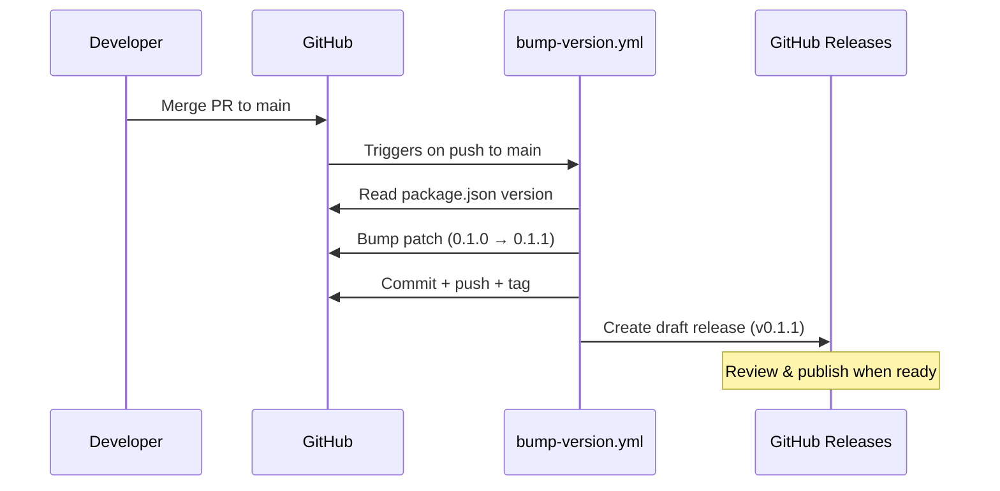
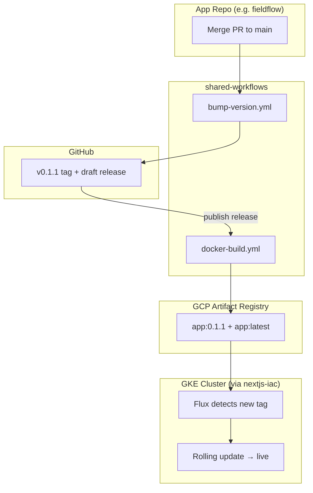

# shared-workflows

Reusable GitHub Actions workflows for Blair Tech Works repos. Centralizes CI logic so app repos stay thin.

---

## Available Workflows

### `docker-build.yml` — Build & Push to GCP Artifact Registry



**Auto-tagging logic:**

| Trigger | Tags Applied |
|---------|-------------|
| Pull Request | `pr-<number>` |
| Push to branch | `sha-<short>`, `latest` |
| GitHub Release | `<semver>`, `latest` |
| Explicit `tags` input | Whatever you specify |

**Usage in your app repo:**

```yaml
# .github/workflows/ci.yml
name: Build & Push
on:
  push:
    branches: [main]
  pull_request:

jobs:
  build:
    uses: blair-tech-works/shared-workflows/.github/workflows/docker-build.yml@main
    with:
      image-name: my-app          # → pushed to .../apps/my-app
    secrets:
      GCP_SA_KEY: ${{ secrets.GCP_SA_KEY }}
```

**Inputs:**

| Input | Required | Default | Description |
|-------|----------|---------|-------------|
| `image-name` | Yes | — | Image name (e.g. `fieldflow`) |
| `registry` | No | `us-west1-docker.pkg.dev` | AR host |
| `project-id` | No | `sandbox-438722` | GCP project |
| `ar-repo` | No | `apps` | AR repository name |
| `dockerfile` | No | `Dockerfile` | Dockerfile path |
| `build-args` | No | — | Newline-separated `KEY=VALUE` |
| `tags` | No | auto-detected | Comma-separated explicit tags |

---

### `bump-version.yml` — Auto Version Bump & Draft Release



**Usage in your app repo:**

```yaml
# .github/workflows/release.yml
name: Bump Version & Release
on:
  push:
    branches: [main]

jobs:
  version:
    uses: blair-tech-works/shared-workflows/.github/workflows/bump-version.yml@main
    secrets:
      BOT_ACCESS_TOKEN: ${{ secrets.BOT_ACCESS_TOKEN }}
```

**Inputs:**

| Input | Required | Default | Description |
|-------|----------|---------|-------------|
| `version-type` | No | `patch` | Semver bump: `patch`, `minor`, `major` |

---

## Full CI/CD Pipeline

Combining both workflows gives you a complete pipeline:



## Required Secrets

Set these in your app repo (Settings → Secrets → Actions):

| Secret | Purpose |
|--------|---------|
| `GCP_SA_KEY` | Service account JSON with Artifact Registry Writer role |
| `BOT_ACCESS_TOKEN` | PAT with `repo` scope for version bump commits |
